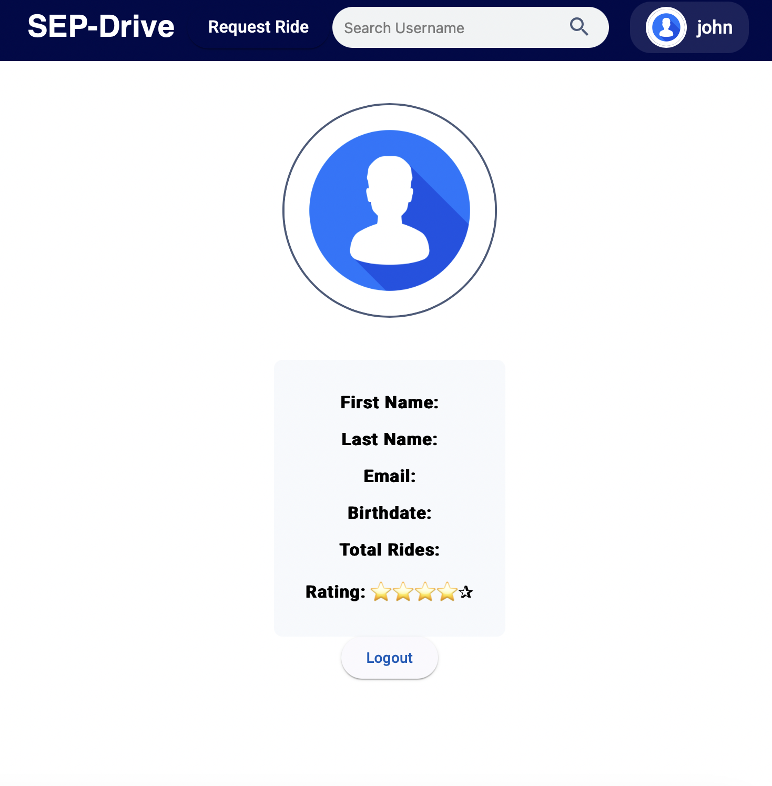
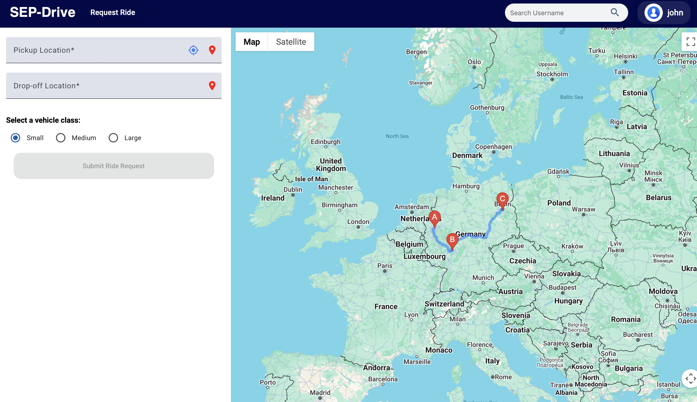

# Drive-Up 🚗

**Drive-Up** is a ride-sharing app backend built with Spring Boot and MySQL. It supports secure user registration, ride requests, and map-based routing. This project simulates a simplified Uber-like system.

---

## 📸 Screenshots

### Homepage View


### Ride Request View


---

## 🛠️ Tech Stack

- Spring Boot
- MySQL
- Angular (Frontend)
- Google Maps API
- JWT + 2FA

---

## 🚀 How to Run

1. Clone the repo:
   ```bash
   git clone https://github.com/Marwan11500/drive-up.git
   cd drive-up
