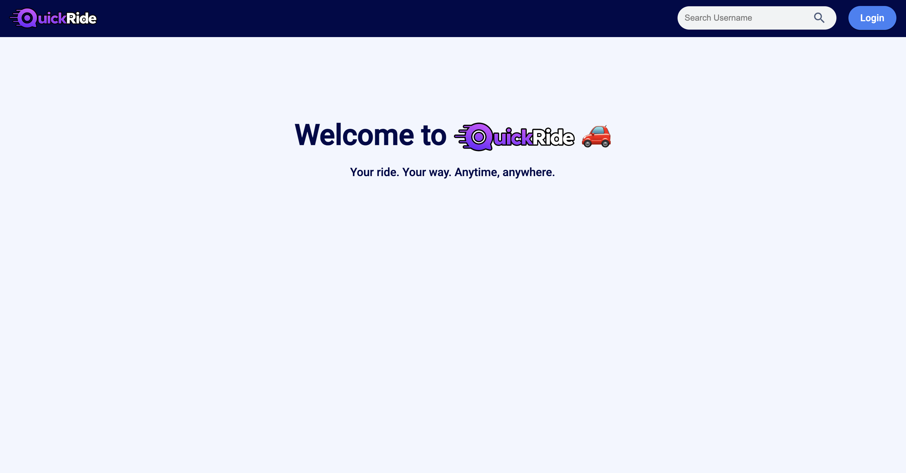
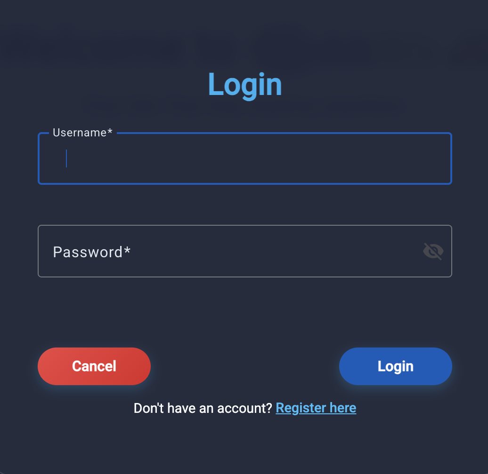
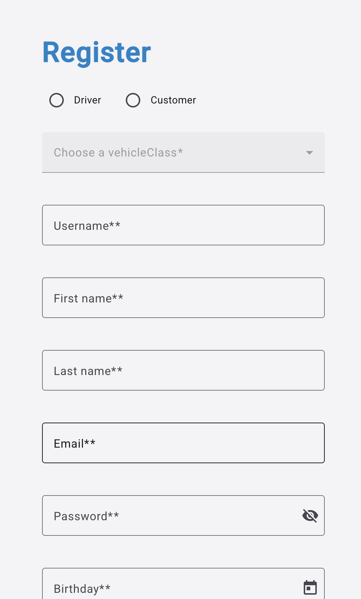
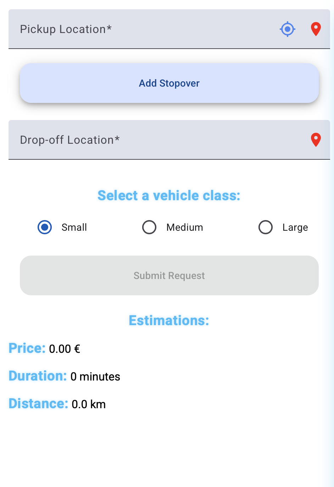

# 🚗 Drive-Up — Smart Ride-Sharing App

Drive-Up is a full-stack ride-sharing application developed as part of a university software engineering project. It enables customers to request rides, drivers to accept them, and both parties to interact in real time with route simulation, location tracking, and secure login.

---











## 🧩 Features

### ✅ Frontend (Angular)
- Google Maps integration
- Real-time ride simulation
- Chat & driver-customer sync
- Responsive UI with modern design

### ✅ Backend (Spring Boot + MySQL)
- JWT-based authentication with 2FA
- Role-based access control (Customer, Driver, Admin)
- Booking logic with conflict handling
- WebSocket-powered real-time updates

### ✅ Infrastructure
- Dockerized services (`docker-compose`)
- GitHub-managed CI
- MySQL persistent database

---

## 🛠️ Tech Stack

| Layer     | Technology            |
|-----------|------------------------|
| Frontend  | Angular, TypeScript, SCSS |
| Backend   | Java, Spring Boot, Spring Security |
| Database  | MySQL                  |
| Auth      | JWT, Two-Factor Auth   |
| Real-Time | WebSocket              |
| DevOps    | Docker, GitHub         |

---

## 🏁 How to Run the Project

1. **Clone the repository:**
   ```bash
   git clone https://github.com/Marwan11500/drive-up.git
   cd drive-up

Start the backend:
cd Backend
./mvnw spring-boot:run


Start the frontend:
cd ../frontend
npm install
ng serve

OR use Docker Compose:
docker-compose up --build

drive-up/
│
├── Backend/              → Spring Boot backend (API, Auth, DB, WebSocket)
├── frontend/             → Angular frontend
├── docker-compose.yml    → Optional Docker orchestration
└── .gitignore


